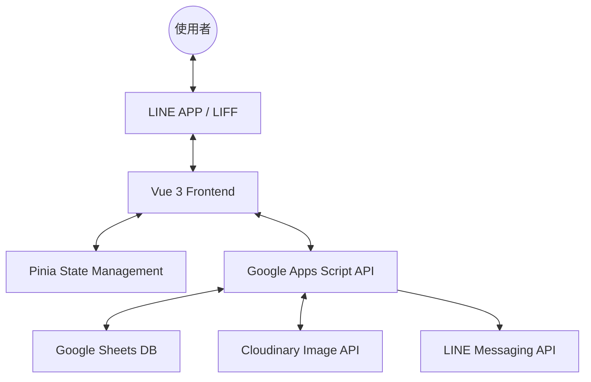

# Nanikore.c 日本代購精選商城 🇯🇵

這是一個專為 LINE LIFF 環境設計的輕量級電商解決方案。結合了 Vue 3 的現代前端開發體驗與 Google Apps Script (GAS) 的強大雲端自動化能力，實現了從商品展示、購物車、訂單追蹤到完整後台管理的閉環。

## ✨ 核心特色

### 🎨 視覺設計 (Unified UI/UX)

- **Glassmorphism 玻璃擬態**：全站統一採用精緻的玻璃質感設計，搭配流暢的毛玻璃效果與毛玻璃投影。
- **即時統計面板**：所有頁面（前台/後台）頂部均設有動態統計列，數據即時反應庫存與訂單現狀。
- **Mobile First**：針對 LINE 內嵌瀏覽器深度優化，支援 iOS/Android 安全區域 (Safe Area)。

### 🛍️ 購物功能

- **LINE LIFF 整合**：一鍵登入，自動獲取使用者頭像與名稱，下單後自動傳送 LINE 訊息通知。
- **批次下單系統**：支援購物車多品項一次性結帳，生成統一訂單編號。
- **訂單追蹤**：使用者可隨時查看歷史訂單及其配送狀態（處理中、已發貨、已完成、已取消）。

### ⚙️ 管理系統 (Admin Suite)

- **商品管理中心**：
  - 支援完整 CRUD (增刪查改)。
  - **狀態管理**：現貨 (AVAILABLE)、已售完 (SOLD_OUT)、暫存 (TEMP - 僅管理員可見)。
  - **圖片優化**：串接 Cloudinary API 實現自動裁剪、壓縮與格式轉換。
- **訂單總覽中心**：
  - 依訂單批次 (Batch ID) 分群管理。
  - 一鍵切換配送狀態，即時同步至使用者端。

---

## 🏗️ 系統架構



### 技術棧

| 領域 | 使用技術 |
| :--- | :--- |
| **前端框架** | Vue 3 (Composition API), Vite |
| **狀態管理** | Pinia |
| **通訊協定** | Axios |
| **後端服務** | Google Apps Script (GAS) |
| **資料存儲** | Google Sheets |
| **第三方整合** | LINE LIFF SDK, Cloudinary, SweetAlert2 |
| **樣式處理** | Vanilla CSS (Scoped) + Glassmorphism System |

---

## 🚀 快速上手

### 1. 環境變數配置

在 `shop` 目錄下建立 `.env` 檔案：

```env
VITE_API_URL=您的_GAS_網頁應用程式網址
VITE_LIFF_ID=您的_LINE_LIFF_ID
```

### 2. 前端開發

```bash
# 安裝依賴
npm install

# 啟動開發伺服器
npm run dev

# 構建生產版本
npm run build
```

### 3. 後端部署 (GAS)

1. 在 Google 試算表中建立兩個分頁：`products` 與 `orders`。
2. 將 `backend/Code.js` 的內容貼入 GAS 專案。
3. 設定專案屬性：`CLOUDINARY_CLOUD_NAME`, `CLOUDINARY_UPLOAD_PRESET`, `ADMIN_ID` (LINE User ID)。
4. 部署為「網頁應用程式」，並授予存取權。

---

## 📁 專案結構

```text
Project Root/
├── shop/                # 前端 Vite 專案
│   ├── src/
│   │   ├── components/  # 共用組件 (ProductCard, ProductRow, Modal 等)
│   │   ├── services/    # 外部服務 (API, LIFF, Cloudinary 優化)
│   │   ├── stores/      # Pinia Stores (購物車、商品資料)
│   │   └── views/       # 主要頁面 (Home, Cart, History, Admin系列)
│   └── .env             # 前端環境變數
└── backend/             # 後端 GAS 相關
    └── Code.js          # Google Apps Script 後端邏輯
```

---

## 📈 未來優化建議

- **搜尋與過濾**：新增後台商品關鍵字搜尋與訂單日期篩選。
- **營業額統計**：在訂單管理頁面加入期間營業額報表。
- **Skeleton Loading**：使用骨架屏提升初次載入的感知速度。
- **過渡動畫**：加入頁面間的滑動切換效果。

---

© 2026 Nanikore.c - 精品、代購、生活。
